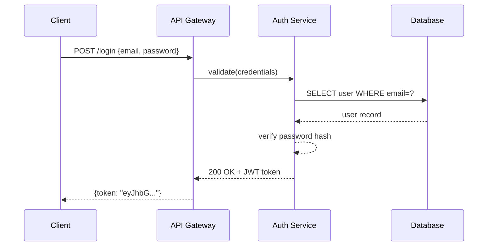
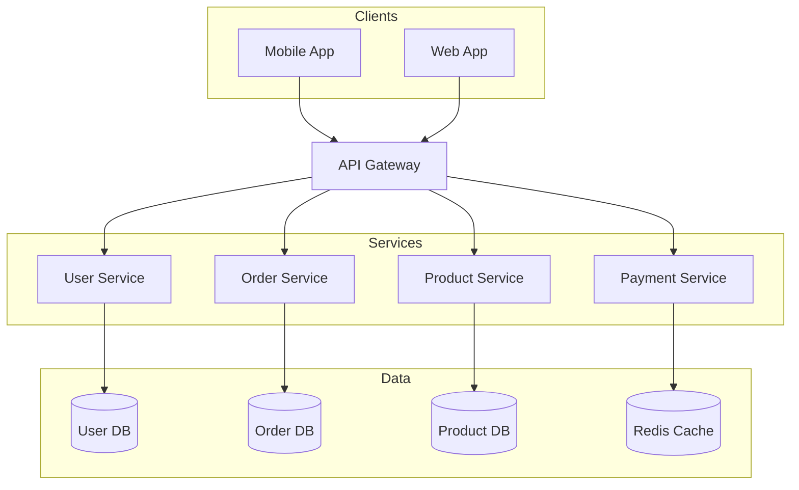
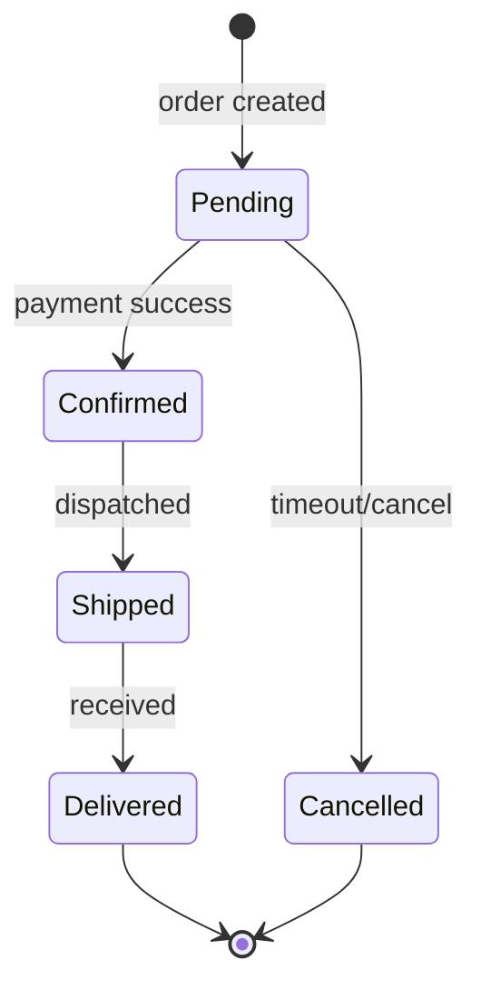
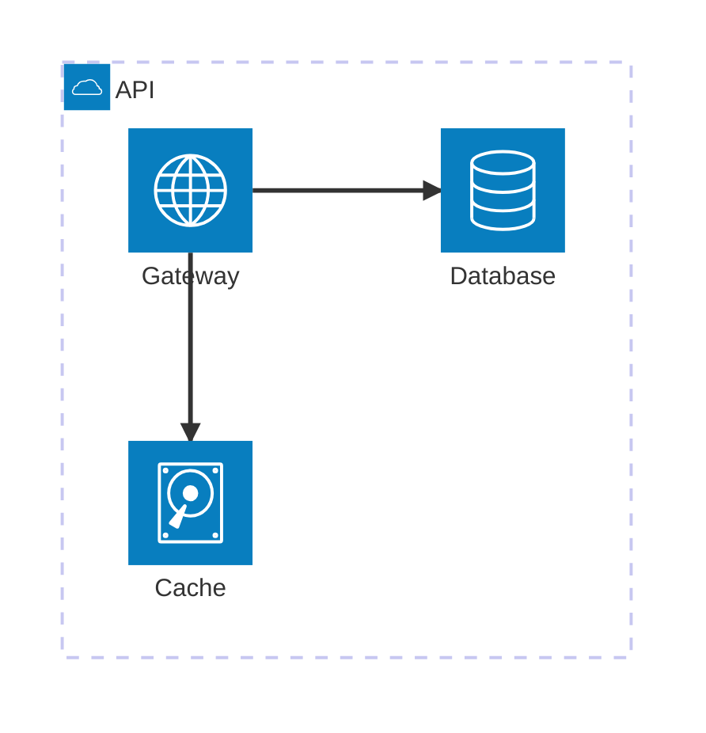

# Mermaid Diagrams

Author Mermaid diagrams as `.mmd` text files. **This skill writes the source only** — no rendering, no export.

**Key advantage:** Text-based syntax with **fully automatic layout** — no x/y coordinates needed. The `.mmd` file is versionable, embeds in Markdown, and can be rendered later by any Mermaid renderer.

## When to use / when NOT to use

**Use this skill for:** diagrams-as-code with automatic layout (flowchart, sequence, class, state, ER, gantt, mindmap, architecture, …) — text source that lives in git and embeds in Markdown.

**Do NOT use it — route elsewhere — for:**

- Rendering `.mmd` to **SVG or ASCII/Unicode** → use the **beautiful-mermaid** skill.
- Pixel-precise placement, custom layout, branded icons, or heavy styling → **drawio**.
- A hand-drawn / sketchy aesthetic → **excalidraw** or **tldraw**.
- Strict, conventional UML notation → **plantuml**.

## Workflow

1. **Pick diagram type** — choose from the table below
2. **Generate** — write the `.mmd` file to disk
3. **Review with the user** — apply minimal `.mmd` edits per request (change a label, add/remove a node, swap `TD`↔`LR`, wrap in a `subgraph`, …)
4. **Report** — tell the user the `.mmd` file path(s)

> If the user then wants an image or terminal output, hand the `.mmd` to the **beautiful-mermaid** skill.

## Diagram Types

| Type | Keyword | Use for |
| ------ | --------- | --------- |
| Flowchart | `flowchart TD/LR` | processes, pipelines, decisions |
| Sequence | `sequenceDiagram` | API calls, message passing |
| Class | `classDiagram` | OOP models, data structures |
| ER | `erDiagram` | database schemas |
| State | `stateDiagram-v2` | state machines, lifecycle |
| Gantt | `gantt` | project timelines |
| Pie | `pie` | proportions |
| Git Graph | `gitGraph` | branch strategies |
| C4 Context | `C4Context` | high-level system context |
| Architecture | `architecture-beta` | cloud / CI/CD service layouts |
| Mind Map | `mindmap` | topic breakdowns |
| User Journey | `journey` | user-experience flows |
| Use Case | `usecase-beta` | actor–system interactions (UML) |
| Cynefin | `cynefin-beta` | sense-making / complexity domains |
| Event Modeling | `eventmodeling` | event-driven system timelines |
| Tree View | `treeView-beta` | file / directory hierarchies |
| Wardley Maps | `wardley-beta` | business strategy / value chains |

## Syntax Reference

**Flowchart**: See [reference/FLOWCHART.md](reference/FLOWCHART.md)
**Sequence**: See [reference/SEQUENCE.md](reference/SEQUENCE.md)
**Class & ER**: See [reference/CLASS-ER.md](reference/CLASS-ER.md)
**Architecture**: See [reference/ARCHITECTURE.md](reference/ARCHITECTURE.md)
**Use Case**: See [reference/USECASE.md](reference/USECASE.md)
**Other types**: See [reference/OTHER-TYPES.md](reference/OTHER-TYPES.md)

## Examples

### Example 1: API Authentication Flow

**User prompt:**
> Create a sequence diagram for JWT authentication

**Generated `.mmd`:**

**Output file:** `auth-flow.mmd`

---

### Example 2: Microservices Architecture

**User prompt:**
> Draw an e-commerce microservices architecture

**Generated `.mmd`:**

**Output file:** `ecommerce-arch.mmd`

---

### Example 3: Order State Machine

**User prompt:**
> Show order lifecycle states

**Generated `.mmd`:**

**Output file:** `order-states.mmd`

---

### Example 4: Cloud Architecture

**User prompt:**
> Draw a simple service architecture for an API

**Generated `.mmd`:**

**Output file:** `api-architecture.mmd`
