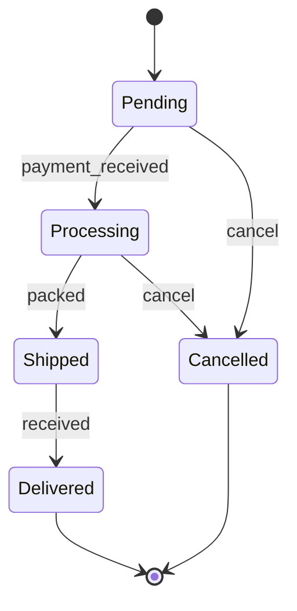
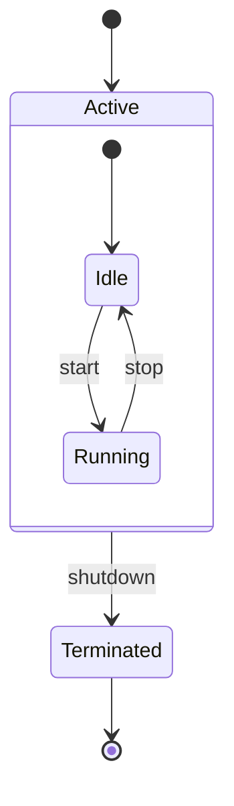
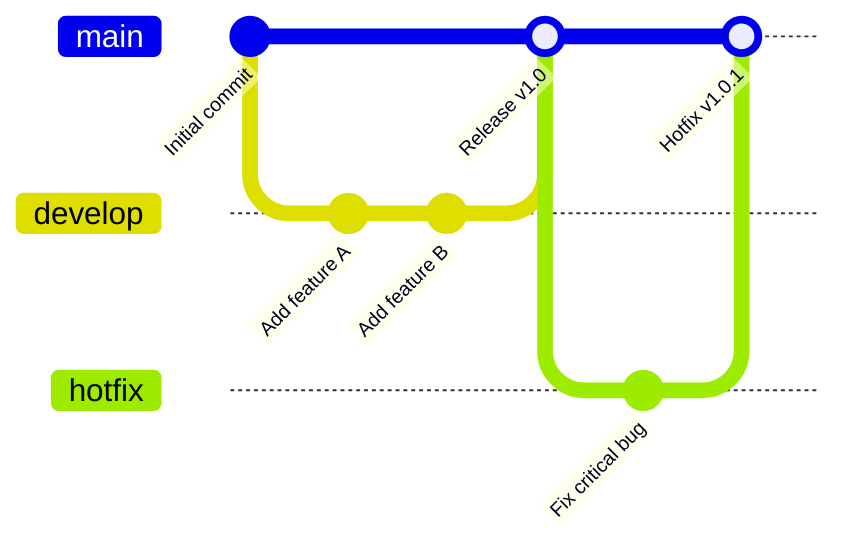
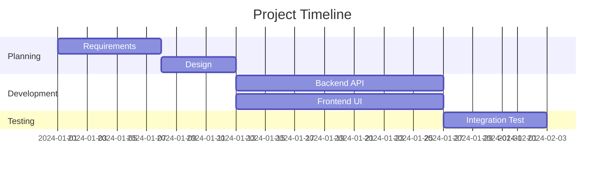
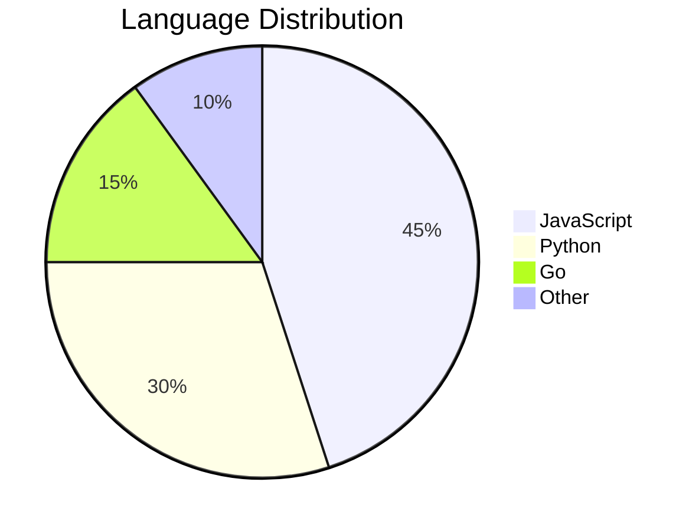
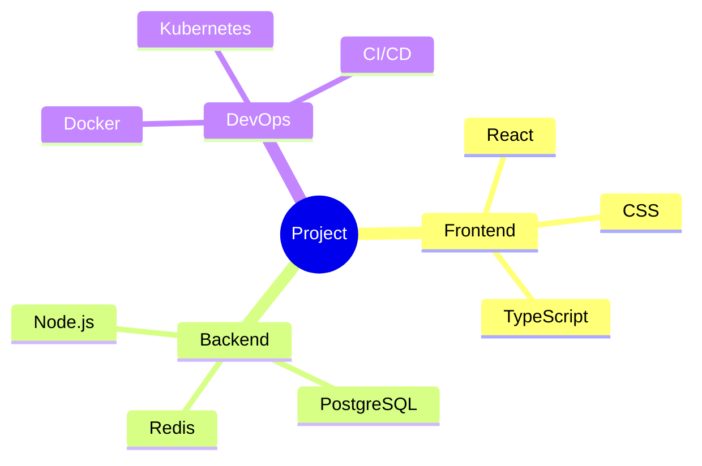
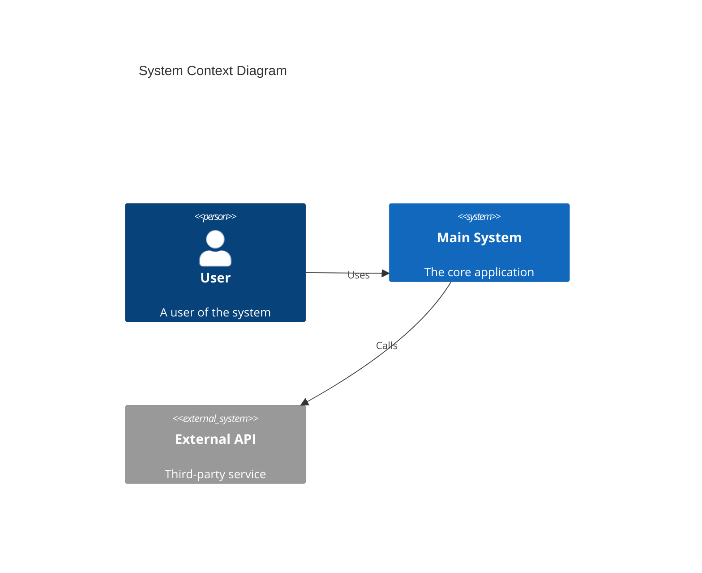
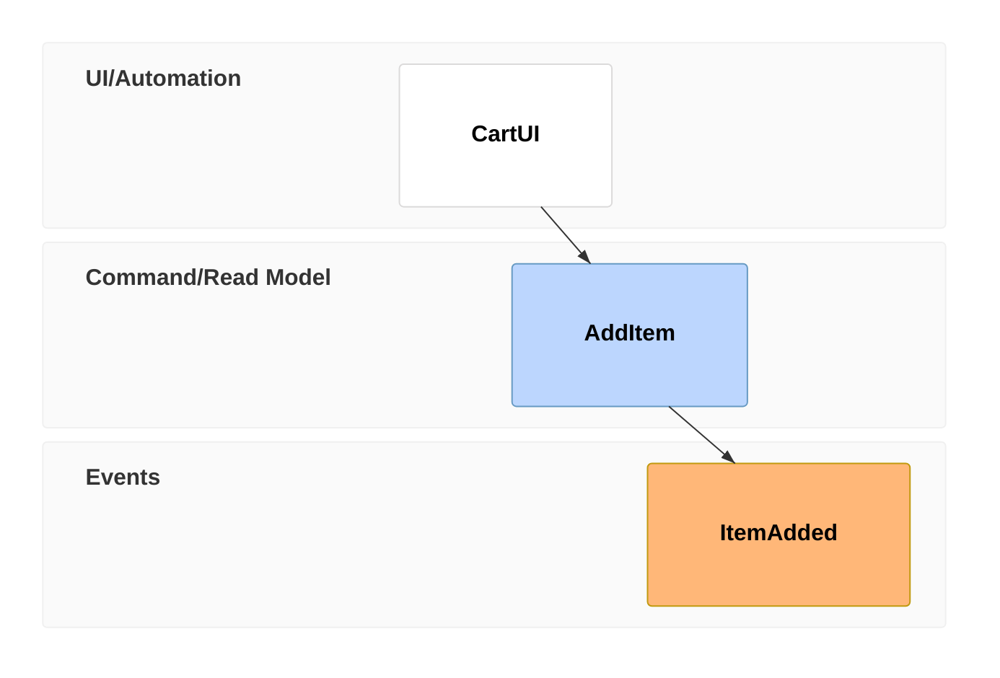

# Other Diagram Types

## State Diagram



### Composite States



---

## Git Graph



---

## Gantt Chart



---

## Pie Chart



---

## Mind Map



---

## C4 Context Diagram



---

## Tree View Diagram

Shows hierarchical / file-tree data with indentation (v11.14+, `treeView-beta`). Directories end with `/`; box-drawing input (`├──`, `└──`, `│`) is auto-detected (v11.16+).


---

## Event Modeling Diagram

Describes information flow over time with swimlane time frames (`eventmodeling`, v11.15+). `tf` = compact, `timeframe` = relaxed. Relations are inferred by default.



Entity kinds: `ui` (UI), `cmd` (command), `evt` (event), plus view / automation / translation patterns. Each time frame needs a unique number.

---

## Cynefin Diagram

Sense-making framework with five complexity domains (`cynefin-beta`, v11.16+): clear, complicated, complex, chaotic, confusion.

```mermaid
cynefin-beta
  title Incident Response

  complex
    "Investigate root cause"
    "Run chaos experiment"

  complicated
    "Analyze performance data"

  clear
    "Restart service"

  chaotic
    "Page on-call immediately"

  confusion
    "Unknown failure mode"

  complex --> complicated : "Pattern identified"
  clear --> chaotic : "Complacency"
```

Keep per-domain item lists short — the quadrants have fixed layout and long lists can overflow. The confusion ellipse caps at 3 items (+N more badge).

---

## Wardley Maps

Business strategy maps positioning components on visibility (Y) × evolution (X) axes (`wardley-beta`, v11.14+).

```mermaid
wardley-beta
  title Tea Shop Value Chain

  anchor Business [0.95, 0.63]
  component Cup of Tea [0.79, 0.61]
  component Hot Water [0.52, 0.80]

  Business -> Cup of Tea
  Cup of Tea -> Hot Water

  evolve Kettle 0.62
```

- Coordinates are `[visibility, evolution]` (0.0–1.0) — **not** (x, y)
- `component Name [v, e]` — a component node; `anchor Name [v, e]` — user/customer node (bold)
- `name -> name` — dependency link; `evolve Name 0.62` — mark evolution movement
- Optional: `size [1100, 600]` canvas, `(inertia)` decorator for legacy components
